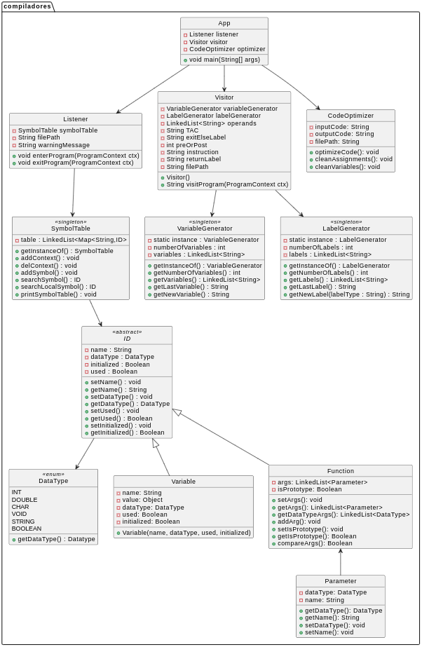
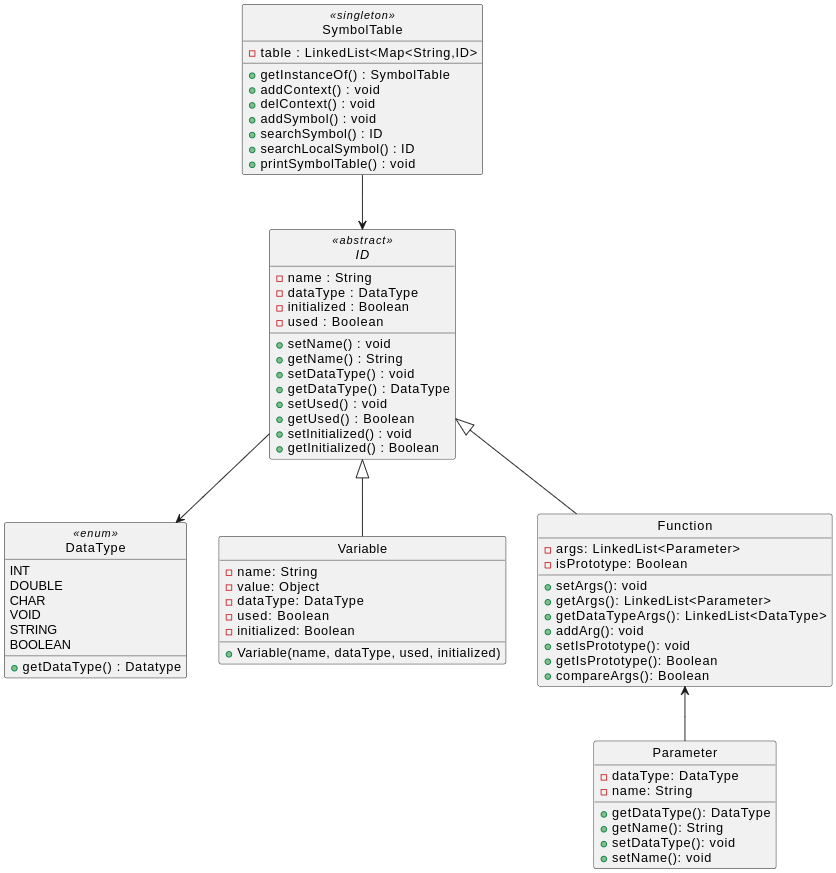

# Compiladores
Proyecto para Practica y Construccion de Compiladores

---

# Objetivo
Desarrollar un compilador para lenguaje C reducido.

Dado un archivo de entrada en C, se debe generar como salida el reporte de errores en caso de existir. Para lograr esto se debe construir un parser que tenga como mínimo la implementación de los siguientes puntos:
- Reconocimiento de bloques de código delimitados por llaves y controlar balance de apertura y cierre.
- Verificación de la estructura de las operaciones aritmético/lógicas y las variables o números afectadas.
- Verificación de la correcta utilización del punto y coma para la terminación de instrucciones.
- Balance de llaves, corchetes y paréntesis.
- Tabla de símbolos.
- Llamado a funciones de usuario.

Si las fases de verificación gramatical y semántica no han encontrado errores, se debe proceder a:
- Detectar variables y funciones declaradas pero no utilizadas y viceversa,
- Generar la versión en código intermedio utilizando código de tres direcciones, el cual fue abordado en clases y se encuentra explicado con mayor profundidad en la bibliografía de la materia,

En resumen, dado un código fuente de entrada el programa deberá generar dos archivos de salida:
- Las tablas de simoblos para cada contexto.
- La version en codigo de tres direcciones del codigo fuente de entrada.

### Implementacion
Para el desarrollo del compilador se llevo a cabo una implementacion separada en diferentes partes, siguiendo la siguiente hoja de ruta:
 
1 - Reglas lexicas y gramaticales.
2 - Implementacion de tabla de simbolos.
3 - Configuracion de Listener.
4 - Configuracion de Visitor.
5 - Generacion de codigo intermedio (ThreeAddressCode).
6 - Optimizacion de codigo intermedio.



*Fig 1. Diagrama UML simplificado del compilador*

### Links relevantes
[Compilador base de la cursada. - (Github)](https://github.com/meschoyez/BaseCompiladores)

[How do computers read code? - (Youtube)](https://youtu.be/QXjU9qTsYCc?si=kcTE7655CQoSiXps) by Frame of Essence

[Comparing C to machine language - (Youtube)](https://www.youtube.com/watch?v=yOyaJXpAYZQ) by Ben Eater.

---

# Marco Teorico

## Compilador
Un compilador es un programa que traduce codigo escrito en un lenguaje de programacion llamado fuente, a otro lenguaje conocido como objeto, el proceso de traduccion se conoce como compilacion. La construccion de un compilador generalmente se agrupa en dos tareas, el analisis del programa fuente y la sinstesis del programa objeto. El analisis se trata de la comprobacion de la correcion del programa fuente y la sintesis tiene como objetivo la generacion de la salida expresada en el lenguaje objeto y suele estar formada por una o varias combinaciones de fases de generacion de codigo y optimizacion de codigo.

La compilacion es un proceso lineal que se divide en etapas, cada etapa se estructura en diferentes fases que cada una realiza una tarea correspondiente. En este trabajo nosostros nos centraremos en el proceso del analisis lexico, sintactico y semantico, pero tambien la generacion del codigo intermedio con una optimizacion basica. No se realizaran las partes de etapa de generacion y optimizacion de codigo objetivo.


*Fig 2. Etapas de compilacion.*

## ANTLR
Para desarrollar este compilador se utilizara ANTLR (Another Tool For Language Recognition). Es una herramienta que se encarga de generar scanners, parsers y tree parsers automatizando la construccion de reconocedores de lenguaje, genera parsers de tipo recursivo descendente para el lenguaje deseado. La funcion principal del ANTLR es facilitar el trabajo al programador, automatizando aquellas tareas mas complicadas que forman parte del proceso de reconocimiento lexico y sintactico de un lenguaje.

### Arbol sintactico
Es una representacion jerarquica de la estructura del codigo fuente, es decir, es una representacion grafica de la estructura del codigo fuente. Se utiliza para representar la estructura sintactica de una cadena de entrada de acuerdo con una gramatica formal. Cada nodo del arbol denota una construccion gramatical de la cadena de entrada. Los nodos internos del arbol denotan operadores no terminales, mientras que las hojas del arbol denotan los operandos o terminales.

#### Recorrido de arbol
Se comienza por la raiz y se recorre el arbol de forma recursiva de la siguiente forma:
- Comenzando de la raiz:
    - Si el nodo es un nodo hoja regresa al padre.
    - De lo contrario se recorre el hijo izquierdo.
- Se repite el proceso hasta que se llegue a un nodo hoja.

## Listener y Visitor
El proceso de recorrer un arbol sintactico se puede realizar de diferentes formas, dos de las formas mas comunes son el **Listener** y el **Visitor**.

### Listener
El **Listener** es un objeto de la clase Listener que se encarga de escuchar cuando sucede un evento determinado, cuando esto ocurre se le avisa al Listener y este reacciona de alguna forma. En el caso de ANTLR, el Listener escucha cuando se entra y se sale de un nodo del arbol sintactico, y puede reaccionar de alguna forma, por ejemplo, puede almacenar la informacion de las variables y funciones en una tabla de simbolos.

#### Deteccion de errores
El Listener es mas adecuado para la deteccion de **errores**, ya que se ejecuta en tiempo de compilacion, es decir, a medida que se va recorriendo el arbol sintactico, se va detectando los errores. Tambien nos sirve para detectar **warnings**, que no son errores pero que pueden causar problemas, como por ejemplo alguna variable inicializada pero no utilizada.

### Visitor
El **Visitor** es un objeto de la clase Visitor que se encarga de visitar cada nodo del arbol sintactico, y puede reaccionar de alguna forma, por ejemplo, puede generar el codigo intermedio a partir del arbol sintactico.

---

# Analisis Lexico o scanning
El analisis lexico es la primera fase de un compilador, su funcion es leer el codigo fuente caracter por caracter y agruparlos en unidades logicas llamadas tokens. Un token es una secuencia de caracteres que juntos tienen un significado. El analizador lexico se encarga de reconocer los tokens y pasarlos al analizador sintactico para que este los analice.

ANTLR nos facilita la creacion de estas expresiones con un archivo compiladores.g4
``` antlr
fragment LETTER     : [A-Za-z]  ;
fragment DIGIT      : [0-9]     ;
fragment INT        : 'int'     ;

O_PAREN             : '('       ;
C_PAREN             : ')'       ;
O_BRACE             : '{'       ;
C_BRACE             : '}'       ;

TYPE                : (INT | DOUBLE | CHAR | VOID | STRING | BOOLEAN)   ;
ID                  : (LETTER | '_')(LETTER | DIGIT | '_')*             ;
NUMBER              : DIGIT+                                            ;
TEXT                : '"' (LETTER | '_') (LETTER | DIGIT | '_')* '"'    ;
WS                  : [ \n\t\r] -> skip                                 ;
OTHER
```

La palabra `FRAGMENT` hace referencia a no quiere que la expresion regular sea un `TOKEN` si no que quiero que sea parte de otro `TOKEN`, por ejemplo la expresion regular `INT` no es un `TOKEN` si no que es parte de otro `TOKEN` que es `TYPE`.

# Analisis Sintactico o parsing
El analisis sintactico es la segunda fase de un compilador, su funcion es analizar la estructura del codigo fuente y comprobar que cumpla con la gramatica del lenguaje. El analizador sintactico recibe los tokens del analizador lexico y los analiza para comprobar que cumplan con la gramatica del lenguaje. La gramatica del lenguaje se define mediante reglas recursivas, donde el resultado sera una jerarquia de tokens represnetados en forma de arbol. Si el analizador sintactico encuentra un error en el codigo fuente, este debe detenerse y mostrar el error encontrado.

Por ejemplo en el mismo compiladores.g4 se puede definir la gramatica del lenguaje
``` antlr
if_stmt     : IF O_PAREN logical_arithmetic_expression C_PAREN instruction else_stmt
            ;

else_stmt   : ELSE IF O_PAREN logical_arithmetic_expression C_PAREN instruction else_stmt
            | ELSE instruction
            |
            ;
```

A traves de ANTLR podemos visualizar el `railroad` de las reglas gramaticales que definimos en nuestro archivo compiladores.g4, esto nos permite visualizar de forma grafica la jerarquia de tokens que se generan a partir de las reglas gramaticales. Por ejemplo para la regla ID se generaria el siguiente arbol:


*Fig 3. Diagrama logico generado en el .g4*

Conceptualmente se puede ver la fase del analisis lexico y sintactico como dos fases diferentes, pero en el momento de la ejecucion el compilador puede ejecutar estas dos etapas en forma conjunta. El analizador sintactico solicita los nuevos tokens al analizador lexico a medida que los va necesitando.

# Analisis semantico
El analisis semantico es la tercera fase de un compilador, su funcion es analizar el significado del codigo fuente y comprobar que cumpla con las reglas semanticas del lenguaje, es decir que lo que escribimos tenga un sentido. El analizador semantico recibe los tokens del analizador lexico y los analiza para comprobar que cumplan con las reglas semanticas del lenguaje. Si el analizador semantico encuentra un error en el codigo fuente, este debe detenerse y mostrar el error encontrado. 

Por ejemplo si tenemos el codigo:
```c
int main() {
    int a = 5;
    char* b = "Hello";
    printf("%d\n", a+b);
    return 0;
}
```

Podriamos decir que el codigo es correcto en cuanto a la gramatica del lenguaje, pero si analizamos el significado del codigo, nos damos cuenta que hay un error en la linea 4, ya que no se puede sumar un entero con un string. El analizador semantico se encargara de detectar este tipo de errores.

--- 

# Tabla de Simbolos
La tabla de simbolos es uno de los elementos mas importantes en un compilador, su funcion es almacenar la informacion de las variables, funciones y constantes que se utilizan en el programa fuente. Se utiliza para comprobar que las variables y funciones se utilicen de forma correcta, es decir que se declaren antes de ser utilizadas, nuestra tabla lleva un control de esta informacion por cada contexto del programa, es decir que va a guardar una lista de contextos con la informacion anteriomente nombrada. Es un paso importante en el analisis semantico para comprobar que las variables y funciones se utilicen de forma correcta.

La tabla de simbolos se puede implementar de diferentes formas, en este trabajo se utilizara una tabla de simbolos implementada como una lista enlazada. Cada nodo de la lista contendra la informacion de una variable o funcion, como el nombre, el tipo, el alcance, etc.



*Fig 4. Diagrama UML de la tabla de simbolos*

La implementacion se puede ver en el diagrama UML donde se utilizo una LinkedList de HashMaps para almacenar la informacion de las variables y funciones, al que es posible acceder mediante un token o valor. Y es el Listener el encargado de llenar nuestra tabla de simbolos al recorrer el arbol sintactico y llegar a una funcion de exit().

Para nuestro caso tambien se llevara un control de si la variable se uso o no, si se inicializo o no, el nombre y el tipo de la variable.
```log
----------------- Symbol Table -----------------
NAME                TYPE      USED  INITIALIZED 
addition            INT       true  false       
main                INT       true  true        
var1                INT       true  true        
var2                INT       true  true        
result              INT       true  true        
```

---

# Codigo intermedio
El codigo intermedio o three-adress-code (TAC) es una representacion intermedia de un programa fuente, es decir es una representacion intermedia entre el codigo fuente y el codigo objeto. Se utiliza para simplificar el proceso de generacion de codigo objeto, ya que es lo suficientemente abtracto para ser independiente de la arquitectura de la maquina, pero es muy concreto como para ser optimizado.

Para llegar a esta etapa de compilacion podemos asegurar que nuestro arbol no tiene errores lexicos, semanticos ni sintactico. Esto no quiere decir que el programa se ejecute de la manera que deseamos, si no que puede ser ejecutado.

Se le dice tres direcciones ya que cada instruccion tiene a lo sumo solo tres operandos o direcciones de memoria. Los operandos no contienen direcciones de memoria concretas, si no simbolicas que luego son convertidas en direcciones reales una vez asignados los registros.

Un ejemplo de generacion:
```c
/* Codigo C */
z = 2 * (x + 3 * y);

/* Codigo TAC */
t0 = 3 * y
t1 = x + t0
t2 = 2 * t1
z = t2
```

```c
/* Codigo C */
if (x > 0)
    y = z + 5;
else
    y = z - 5;

/* Codigo TAC */
t0 = x > 0
ifnjmp t0 jmp l0
    y = z + 5
    jmp l1
label l0
    y = z - 5
label l1
```

Para poder generar este codigo utilizamos el visitor que nos provee ANTLR, el cual recorre el arbol sintactico y va visitando los nodos en particular. Tambien necesitamos hacer uso de un generador de variables temportales (t0, t1, t2, ...) donde se almacenan los resultados de las operaciones, y un generador de etiquetas (labels) para los saltos condicionales en nuestro codigo, la implementacion de estos dos generadores es muy sencilla y similar, ya que solo necesitamos un contador que se incremente cada vez que se necesite una nueva variable temporal o etiqueta.


*Fig 5. Diagrama UML de los generadores de variables y labels.*

---

# Optimizacion de codigo intermedio

En la optimizacion de codigo intermedio lo que se busca es mejorar el codigo para que sea mas eficiente, es decir que se ejecute en menos tiempo o que ocupe menos memoria. La optimizacion de codigo intermedio se puede realizar de diferentes formas, en este trabajo se implemento una optimizacion basica que consiste en la eliminacion de instrucciones redundantes y la eliminacion de variables no utilizadas.


*Fig 6. Diagrama UML de la optimizacion de codigo intermedio.*

Una variable es redundante cuando su valor no se utiliza en ninguna otra operacion, y esta puede ser reemplazada por el valor que se le asigno. Por ejemplo:
```
t0 = 5;             t1 = 5
t1 = t0;    --->    t2 = t1     --->    t2 = 5
t2 = t1;
```

Para la eliminacion de variables no utilizadas ... (completar)

---

# Ejemplo de ejecucion

... (completar)